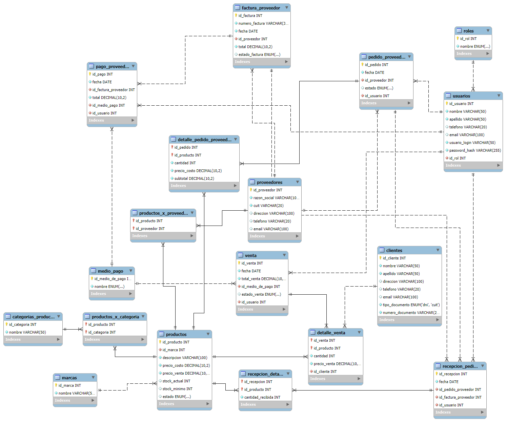
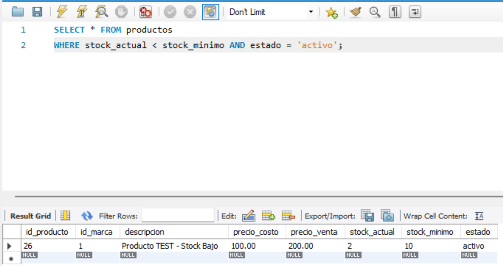
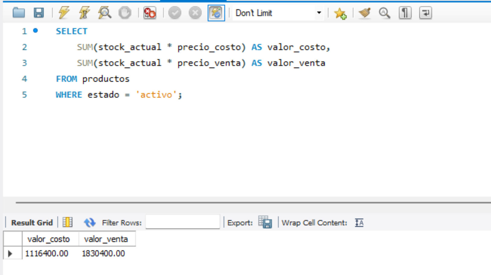

# Modelo de Datos - Ferretería "El Tornillo"

> Documentación técnica de la base de datos del sistema

---

## Resumen

| Característica | Detalle |
|----------------|---------|
| **Motor** | MySQL 8.0 |
| **Tablas** | 18 |
| **Vistas** | 4 |
| **Relaciones** | 22 claves foráneas |
| **Normalización** | 3NF (con excepción controlada) |

---

## Diagrama Entidad-Relación



*Diagrama generado mediante ingeniería inversa desde MySQL Workbench.*

---

## Diseño del Modelo

### Principios aplicados

1. **Integridad referencial:** Todas las relaciones están definidas con claves foráneas.
2. **Auditoría:** Cada transacción registra el `id_usuario` que la realizó.
3. **Estandarización:** Uso de `ENUM` para estados fijos y tablas maestras para datos variables.

---


## Diccionario de Datos

> **Nota:** El detalle completo de campos, tipos y restricciones se desarrolla en el **Diccionario de Datos** (documento separado). Este documento se enfoca en la estructura general y las decisiones de diseño, basadas en el relevamiento del sistema y en el Diccionario de Datos como fuente principal para la definición de los campos.

### 1. Tablas Maestras

| Tabla | Propósito |
|-------|-----------|
| `roles` | Roles de usuario disponibles en el sistema |
| `usuarios` | Usuarios del sistema con credenciales de acceso |
| `clientes` | Clientes de la ferretería |
| `marcas` | Catálogo de marcas de productos |
| `categorias_producto` | Catálogo de categorías de productos |
| `productos` | Catálogo de productos con precios y stock |
| `proveedores` | Proveedores de productos |
| `medio_pago` | Medios de pago disponibles en el sistema |

---

### 2. Tablas Transaccionales

| Tabla | Propósito |
|-------|-----------|
| `venta` | Cabecera de cada transacción de venta |
| `detalle_venta` | Líneas de detalle de cada venta (productos vendidos) |
| `pedido_proveedor` | Cabecera de pedidos a proveedores |
| `detalle_pedido_proveedor` | Líneas de detalle de pedidos a proveedores |
| `factura_proveedor` | Facturas recibidas de proveedores |
| `recepcion_pedido` | Registro de recepción de pedidos |
| `recepcion_detalle` | Líneas de detalle de recepción de pedidos |
| `pago_proveedor` | Registro de pagos a proveedores |

---

### 3. Tablas de Relación (Muchos a Muchos)

#### `productos_x_categoria`

Relaciona productos con categorías.

| Campo | Tipo | Descripción |
|-------|------|-------------|
| `id_producto` | INT FK | ID del producto (PK compuesta) |
| `id_categoria` | INT FK | ID de la categoría (PK compuesta) |

#### `productos_x_proveedor`

Relaciona productos con proveedores.

| Campo | Tipo | Descripción |
|-------|------|-------------|
| `id_producto` | INT FK | ID del producto (PK compuesta) |
| `id_proveedor` | INT FK | ID del proveedor (PK compuesta) |


## Vistas utilizadas


### 1. `VentasCompletas`

**Propósito:** Historial de ventas con datos completos de cliente, usuario y medio de pago.

```sql
CREATE VIEW VentasCompletas AS
SELECT 
    v.id_venta,
    v.fecha,
    CONCAT(c.nombre, ' ', c.apellido) AS cliente,
    p.descripcion AS producto,
    dv.cantidad,
    dv.precio_venta,
    (dv.cantidad * dv.precio_venta) AS subtotal_linea,
    mp.nombre AS medio_pago,
    u.usuario_login AS vendedor,
    v.estado_venta
FROM venta v
JOIN detalle_venta dv ON v.id_venta = dv.id_venta
JOIN clientes c ON dv.id_cliente = c.id_cliente
JOIN productos p ON dv.id_producto = p.id_producto
JOIN medio_pago mp ON v.id_medio_de_pago = mp.id_medio_de_pago
JOIN usuarios u ON v.id_usuario = u.id_usuario;
```

### 2. `ResumenClientes`

**Propósito:** Estadísticas de compras por cliente.

```sql
CREATE VIEW ResumenClientes AS
SELECT 
    c.id_cliente,
    c.numero_documento,
    CONCAT(c.nombre, ' ', c.apellido) AS cliente,
    COUNT(DISTINCT dv.id_venta) AS cantidad_tickets,
    SUM(dv.cantidad * dv.precio_venta) AS total_gastado
FROM clientes c
JOIN detalle_venta dv ON c.id_cliente = dv.id_cliente
JOIN venta v ON dv.id_venta = v.id_venta
WHERE v.estado_venta = 'confirmada'
GROUP BY c.id_cliente, c.numero_documento, c.nombre, c.apellido;
```

**Nota:** Solo considera ventas con `estado_venta = 'confirmada'`. Las ventas anuladas quedan excluidas del cálculo.

### 3. ProductosMasVendidos

**Propósito:** Top 10 productos más vendidos.

```sql
CREATE VIEW ProductosMasVendidos AS
SELECT 
    p.id_producto,
    p.descripcion,
    SUM(dv.cantidad) AS total_unidades_vendidas,
    SUM(dv.cantidad * dv.precio_venta) AS ingresos_generados
FROM productos p
JOIN detalle_venta dv ON p.id_producto = dv.id_producto
JOIN venta v ON dv.id_venta = v.id_venta
WHERE v.estado_venta = 'confirmada'
GROUP BY p.id_producto, p.descripcion
ORDER BY total_unidades_vendidas DESC;
```

### 4. ResumenInventario

**Propósito:** Estado general del inventario.

```sql
CREATE VIEW ResumenInventario AS
SELECT 
    id_producto,
    descripcion,
    stock_actual,
    stock_minimo,
    (stock_actual * precio_costo) AS valor_costo_total,
    (stock_actual * precio_venta) AS valor_venta_estimado,
    CASE 
        WHEN stock_actual <= 0 THEN 'Sin Stock'
        WHEN stock_actual <= stock_minimo THEN 'Reponer Urgente'
        ELSE 'Stock Normal'
    END AS estado_stock
FROM productos
WHERE estado = 'activo';
```

### Relaciones Principales

## Ventas

```text
medio_pago (1) ---< (N) +
                        |
usuarios (1) -----< (N) venta (1) ---< (N) detalle_venta (N) >--- (1) productos
                                                |
clientes (1) -----------------------------< (N) +
```

## Compras

```text
proveedores (1) ---< (N) pedido_proveedor (1) ---< (N) detalle_pedido_proveedor (N) >--- (1) productos
```

## Pagos a Proveedores

```text
factura_proveedor (1) ---< (N) pago_proveedor (N) >--- (1) medio_pago
```

### Reglas de Negocio

| Entidad | Campo | Valores posibles |
|---------|-------|------------------|
| `productos` | `estado` | `activo`, `discontinuado`, `eliminado` |
| `venta` | `estado_venta` | `confirmada`, `anulada` |
| `factura_proveedor` | `estado_factura` | `pendiente`, `pagada` |
| `pedido_proveedor` | `estado` | `pendiente`, `recibido` |
| `roles` | `nombre` | `admin`, `vendedor`, `cajero` |
| `medio_pago` | `nombre` | `efectivo`, `tarjeta_debito`, `tarjeta_credito`, `qr` |

### Seguridad

- Contraseñas: Almacenadas con hash SHA-256
- Auditoría: Las transacciones registran id_usuario
- Integridad: Claves foráneas en todas las relaciones

## Consultas Útiles

```sql
-- Productos con stock bajo
SELECT * FROM productos 
WHERE stock_actual < stock_minimo AND estado = 'activo';
```


*Productos con stock bajo, consulta desde MySQL Workbench.*

```sql
-- Valor del inventario
SELECT 
    SUM(stock_actual * precio_costo) AS valor_costo,
    SUM(stock_actual * precio_venta) AS valor_venta
FROM productos 
WHERE estado = 'activo';
```


*Valor del inventario, consulta desde MySQL Workbench.*

## Archivos Relacionados

- **Script SQL:** `database/ferreteria_el_tornillo.sql`
- **Relevamiento:** `Documentacion/RelevamientoOLA.md`
- **Diccionario de Datos:** `Documentacion/Diccionario de Datos.md`
- **README Principal:** `README.md`
